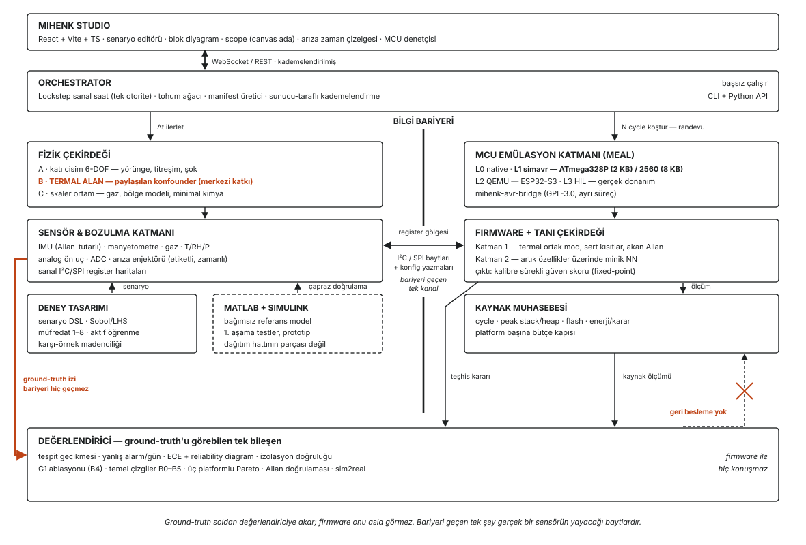

# Özet

Düşük maliyetli sensör düğümleri sahada kaçınılmaz olarak bozulur: bias kayar, ölçek faktörü değişir, kanallar arızalanır. Bu bozulmanın tespiti bugün ya donanım yedekliliği, ya bir araç dinamik modeli, ya harici bir destek referansı (GNSS), ya da kullanıcının cihazı belirli pozisyonlara çevirdiği bir kalibrasyon prosedürü gerektirmektedir. Savunma uygulamalarında bu dört koşulun dördü de görev sırasında sağlanamaz.

Bu rapor, tek bir kaynak-kısıtlı heterojen sensör düğümünün — bu koşulların hiçbiri olmaksızın — kendi ölçümlerinin güvenilirliğine dair kalibre edilmiş ve sürekli bir kestirim üretip üretemeyeceğini araştıran bir projenin mimari tasarımını ve iş planını sunmaktadır.

Çalışmanın merkezi savı, farklı fiziksel büyüklükleri ölçen sensörlerin ortak bir konfounder — her şeyden önce sıcaklığı — paylaştığı ve bu paylaşımın referans gerektirmeyen bir ayrıştırma sağladığıdır: bir kanaldaki değişim ya tüm kanallarda görülen ortak moddur (sebep ortamdır) ya da yalnız o kanala özgüdür (sebep sensördür). Yapılan literatür taraması, bu mekanizmanın atalet sensörü arıza teşhisi literatüründe işlenmemiş olduğunu göstermektedir.

Savın tasarlanabilmesi, ölçülebilmesi ve doğrulanabilmesi için MIHENK adlı bir ortak simülasyon ortamı önerilmektedir. MIHENK; katı cisim dinamiği, termal alan ve skaler ortam fiziğini, ayrıntılı sensör bozulma modellerini ve gerçek mikrodenetleyici emülasyonunu tek bir deterministik zaman tabanında birlikte koşturur. Ortamın varlık nedeni, gerçek değerlerin (ground-truth) bilinebildiği tek yer olmasıdır: sahada bir sensörün ne kadar saptığı bilinemez, simülasyonda ise bu değer tasarımcı tarafından belirlenir.

Hedef donanımlar ATmega328P (2 KB SRAM), ATmega2560 (8 KB) ve ESP32-S3 (512 KB) olarak belirlenmiştir; bu üçlü, teşhis maliyeti ile teşhis gücü arasındaki ödünleşimin 256 kat genişlikte bir kaynak ekseninde ölçülmesine olanak tanır. Birinci aşama testler MATLAB ve Simulink üzerinde, bağımsız bir referans model olarak yürütülecektir.

\newpage

# Proje Künyesi

| | |
|---|---|
| **Proje adı** | MIHENK — Multi-sensor Intrinsic Health Estimation & Numerical Kernel |
| **Kapsam** | MIHENK Kernel (hesap çekirdeği) + MIHENK Studio (simülasyon ortamı) |
| **Yürütücüler** | Yuşa Göverdik, Batuhan Koca |
| **Danışman** | Doç. Dr. Emre Avuçlu |
| **Kurum** | Aksaray Üniversitesi, Mühendislik Fakültesi, Yazılım Mühendisliği Bölümü |
| **Ekip kapasitesi** | 2 öğrenci + 1 danışman (yaklaşık 1,2–1,5 tam zamanlı eşdeğer) |
| **Öngörülen süre** | Yaklaşık 20 ay; minimum yayınlanabilir çekirdek 5–7 ay |
| **Lisans** | Apache-2.0 çekirdek + ayrık GPL-3.0 köprü bileşeni ([§13.1](#s13-1)) |
| **Hedef donanımlar** | ATmega328P (2 KB) · ATmega2560 (8 KB) · ESP32-S3 (512 KB) |
| **Referans platform** | Linux x86_64 ([§13.5](#s13-5)) |
| **Ticari hedef** | Yok. Açık kaynak; akademik ve sektörel kamu yararı. |

## Araştırma Sorusu

> **TR:** Tek, kaynak-kısıtlı, heterojen bir sensör düğümü — donanım yedekliliği, bir plant modeli, harici destek referansı (GNSS) ve kullanıcı manevrası olmaksızın — kendi ölçümlerinin güvenilirliğine dair **kalibre edilmiş, sürekli** bir kestirim üretebilir mi; ve bunun **kaynak maliyeti** nedir?

> **EN:** Can a single, resource-constrained, heterogeneous multi-sensor node — without hardware redundancy, a plant model, an external aiding reference, or user-performed calibration manoeuvres — produce a calibrated, continuous estimate of the trustworthiness of its own measurements, and at what resource cost?

Sorudaki her niteleyici, mevcut literatürde belirli bir çalışma kümesini kapsam dışında bırakmak üzere seçilmiştir; hangi niteleyicinin hangi kümeyi karşıladığı [§1.3](#s1-3)'te verilmiştir.

## Merkezi Katkı İddiası

> **Heterojen bir düğümde, farklı fiziksel büyüklükleri ölçen sensörler yine de konfounder paylaşır — her şeyden önce sıcaklığı. Bu paylaşım bir ayrıştırma doğurur: bir kanaldaki değişim ya ortak moddur (kanallar arasında paylaşılıyor → sebep ortam) ya da kanala özgüdür (→ sebep sensör). Bu ayrıştırma hiçbir referans, donanım yedekliliği, plant modeli, harici destek veya kullanıcı manevrası gerektirmez.**

MIHENK, bu ayrıştırma üzerine kurulu teşhisin tasarlanması, ölçülmesi ve **doğrulanması** için gerekli ölçüm aletidir.

Çalışmanın literatüre göre konumu tek cümleyle ifade edilebilir:

> **Mevcut literatür sensörü dünyayı teşhis etmek için kullanır. MIHENK, dünyanın fiziksel kısıtlarını sensörü teşhis etmek için kullanır.**

\newpage


# 1. MIHENK Nedir {#s1}

MIHENK, kaynak-kısıtlı **heterojen** sensör düğümlerinin kendi ölçümlerinin güvenilirliğini referanssız kestirme yeteneğini tasarlamak, eğitmek, ölçmek ve doğrulamak için kurulmuş bir ortak simülasyon (co-simulation) ortamıdır.

Varlık nedeni tek cümleyle: **simülasyon, ground-truth'un var olduğu tek yerdir.** Sahada bir sensörün o an ne kadar saptığı bilinemez; bilinebilseydi referanssız teşhise zaten ihtiyaç olmazdı. Simülasyonda ise gerçek yönelim, gerçek bias kayması ve gerçek sensör sağlığı tasarımcı tarafından belirlenir. MIHENK bu asimetriyi bir ölçüm aletine dönüştürür.

MIHENK dört şeyi aynı zaman tabanında birlikte koşturur: fiziksel ortam (katı cisim dinamiği + termal alan + skaler ortam), sensör fiziği ve bozulma süreçleri, gerçek firmware (MCU emülasyonu üzerinde), ve aynı MCU'da çalışan tanı çekirdeği. Üzerine MATLAB/Simulink muadili etkileşimli bir ortam (**MIHENK Studio**) ile kendi veri setini üreten bir deney tasarımı katmanı oturur.

## 1.1 Teşhis Kaldıraçları — Güç Sırasına Göre {#s1-1}

MIHENK'in teşhis gücü dört mekanizmadan gelir. Sıralama keyfi değil; literatür taramasının gösterdiği özgünlük ve güç sırası:

**① Termal ortak mod ayrıştırması — merkezi katkı**

Sıcaklık, tüm modaliteleri aynı anda etkileyen tek büyüklüktür: IMU bias ve ölçek faktörünü, manyetometre kazancını, gaz sensörü temel çizgisi ve duyarlılığını. Bu paylaşım, referans gerektirmeyen bir ayrıştırma sağlar:

> Gaz temel çizgisi ve IMU bias'ı **aynı termal imzayla** birlikte hareket ediyorsa → sebep ortam.
> Yalnız biri hareket ediyorsa → sebep o sensör.

Literatür taraması bu mekanizmanın işlenmemiş olduğunu gösterdi (bkz. [§1.3](#s1-3), küme C7). Çapraz-modal PHM literatürü teknik olarak yakın ama **makineyi** teşhis ediyor; yedekli IMU FDI **özdeş** sensör gerektiriyor. Farklı fiziksel büyüklükleri ölçen sensörlerin paylaşılan konfounder üzerinden birbirinin sağlığını teşhis etmesi boş alan.

**② Sert fiziksel kısıtlar (atalet + manyetik domen)**

Olasılıksal çıkarımlar değil, fiziğin dayattığı eşitlikler:

- Durağan halde `‖a‖ = g`
- Gyro entegrasyonundan gelen yönelim, ivmeölçerin yerçekimi vektöründen gelen yönelimle uyuşmak zorunda
- `‖m‖ ≈ const`
- İvme + gyro + manyetometre → **üç bağımsız yönelim kaynağı = 3 yönlü oylama**

Üç yönlü oylamanın özel değeri: ikisi uyuşup biri aykırıysa aykırı olan şüphelidir. Bu, **hangi sensörün bozulduğunu referanssız isimlendirebilen** ender mekanizmalardan biridir. İki kanallı bir sistemde yalnızca "biri bozuk" denilebilir; üç kanalda "hangisi" sorusu yanıtlanabilir. Manyetometrenin zorunlu olmasının asıl gerekçesi bu.

**③ Çapraz duyarlılık işaret testleri (gaz domeni)**

Elektrokimyasal hücrenin bilinen çapraz duyarlılık yapısı, ölçülen çapraz eğimin **işaretinin** kimyanın dayattığı işaretle karşılaştırılmasına izin verir. Yanlış işaret, kanalın nominal büyüklüğü ölçmediğini gösterir.

**④ Akan Allan sapması — bileşen, iddia değil**

Allan varyansı zaten kabul görmüş, referanssız bir karakterizasyon yöntemidir; MIHENK'te sabit bellekte, cihaz üzerinde, akan biçimde hesaplanır. **Ama tek başına katkı olarak sunulmaz** — online Allan kestirimi literatürde mevcut ([§1.3](#s1-3), C5). Birleşik sistemin bir bileşeni olarak konumlanır.

## 1.2 Motivasyon: Savunma Senaryosunun Neden Doğru Çerçeve Olduğu {#s1-2}

Hava kalitesi senaryosunda "referans istasyona götüremiyoruz" bir maliyet sorunudur. Savunma senaryosunda **yapısal bir imkânsızlıktır**: görev sırasında birimi laboratuvara götüremezsiniz, cihazı 12 pozisyona çeviremezsiniz, GNSS reddedilmiş veya aldatılmış olabilir, ve harici referansın kendisi güvenilmezdir. Düğümün kendi sağlığını kendi kendine değerlendirmesi bir konfor değil, zorunluluktur.

Bu çerçeve aynı zamanda araştırma sorusunun niteleyicilerini de doğal kılıyor: "harici destek referansı olmaksızın" savunma bağlamında yapay bir kısıt değil, senaryonun tanımıdır.

## 1.3 Literatür Konumlandırma ve İddia Kapsamı {#s1-3}

Bu bölüm dokümanın geri kalanını yönetir: **her ADR, "bu karar bizi hangi kümeden ayırıyor?" sorusuna cevap verebilmelidir.** Detaylı analiz ayrı raporda (`research-gap-imu-domain.md`); burada operasyonel özet.

| Küme | Ne var | Varsayımı | Bizi ayıran |
|---|---|---|---|
| **C1** Donanım yedekli IMU FDI (parity space, χ²-CUSUM, GLT, dalgacık+EPSA, koni konfigürasyonlar) | Olgun, havacılıkta standart | **≥2 özdeş sensör** | Tek düğüm, **heterojen** set, özdeş yedeklilik yok |
| **C2** Model tabanlı FDI (UAV/quadrotor, parçacık filtresi) | Olgun | **Araç dinamik modeli** | Plant modeli yok; düğüm neye takılı olduğunu bilmez |
| **C3** Destekli FDI (GNSS/IMU teşhis edilebilirliği, yedeksiz) | Doğrudan ilgili | **GNSS** | GNSS yokluğu bu çalışmanın **öncülüdür** |
| **C4** Harici ekipmansız öz-kalibrasyon (çok pozisyonlu, faktörizasyon, in-self) | Olgun, geniş — **en büyük tehdit** | **Kullanıcı manevrası** | (a) çıktı: parametre değil **skor**; (b) **pasif ve sürekli**, prosedür değil; (c) ani arızaları da kapsar |
| **C5** Allan karakterizasyonu (+ online kestirim) | Standart | Karakterizasyon amacı | Amaç **anlık güvenilirlik**, MCU sınıfı, sabit bellek. Tek başına iddia edilmez |
| **C6a** DL ile IMU arıza teşhisi (residual CNN + STFT) | Aktif | **Etiketli arıza verisi**, PC sınıfı | Etiketsiz, MCU sınıfı |
| **C6b** MCU'da TinyML anomali tespiti | Aktif, olgun | **Sensör sağlam varsayılır** | Teşhis nesnesi **makine değil sensör** (tersine çevirme) |
| **C7** Çapraz-modal / çok-modlu PHM (self-supervised cross-modal reconstruction, GNN füzyon) | Aktif, teknik olarak en yakın akraba | Teşhis nesnesi **ekipman** | Teşhis nesnesi sensör; **paylaşılan konfounder ortak mod ayrıştırması yok** |
| **C8** Endüstriyel IMU'larda belirsizlik çıktısı (Xsens vb.) | Ticari pratik | Filtre kovaryansı, destekli, pahalı birim | Referanssız, MCU sınıfı. *Ama: sektörün skora ihtiyaç duyduğunun kanıtı — motivasyon dayanağı* |

**İddia kapsamı kuralı ([ADR-019](#s6)):** Çıplak "referanssız IMU arıza tespiti" iddiası **yasaktır** — C1 ve C4 bu alanı fiilen kaplıyor ve iddia ilk turda reddedilir. Her özgünlük iddiası niteleyicileriyle kurulur ve hangi kümeden ayrıldığını açıkça söyler.

## 1.4 MIHENK Ne Değildir (Non-Goals) {#s1-4}

| Değildir | Neden |
|---|---|
| **CFD veya FEM çözücüsü** | Katı cisim dinamiği + iyi karışmış bölge modeli yeterli. CFD gerçek zamanlılığı öldürür. Harici çıktı *sürücü zaman serisi* olarak içe aktarılabilir. |
| **Navigasyon/füzyon kütüphanesi** | EKF/AHRS yazmaz. Yönelim kestirimi yalnız **tutarlılık testi** amacıyla, minimal. Kullanıcı kendi füzyonunu takar. |
| **Kalibrasyon aracı** | C4 literatürünün yaptığı işi yapmaz. Parametre kestirmez, **güvenilirlik kestirir.** Bu ayrım korunmalı; bulanıklaşırsa özgünlük iddiası düşer. |
| **SPICE / devre simülatörü** | Analog ön uç **davranışsal** düzeyde. |
| **MCU IDE / debugger ikamesi** | GDB'ye delege edilir. |
| **Taktik/navigasyon sınıfı atalet parametre kütüphanesi** | Bilinçli kapsam dışı — [§13.4](#s13-4) (ihracat kontrolü). Ticari/endüstriyel sınıf parçalarla sınırlı. |
| **Ticari ürün / SaaS / bulut** | Telemetri yok, hesap yok, çevrimiçi bağımlılık yok. |
| **Her sensörü destekleyen evrensel kütüphane** | Derin modellenmiş **az sayıda** sensör, yüzeysel çok sayıdan kıyaslanamaz biçimde değerli. |

---

# 2. Tasarım İlkeleri {#s2}

**İ1 — Bilgi bariyeri kutsaldır.** Firmware, gerçek bir sensörün yayacağından **bir bit fazlasını** göremez. Ground-truth ayrı kanaldan yalnızca değerlendiriciye akar. Sızarsa üretilen her sonuç çöptür — ve sessizce çöp olur.

**İ2 — Determinizm bir özellik değil, bir sözleşmedir.** Aynı tohum + aynı yapılandırma + aynı sürüm = bit düzeyinde aynı çıktı (referans platformda). CI her commit'te test eder.

**İ3 — Başsız (headless) önce gelir.** Çekirdek ve CLI, GUI olmadan tam işlevlidir. GUI'nin yapabildiği her şey betikten de yapılabilir — MATLAB paritesi buradadır.

**İ4 — Kaynak muhasebesi birinci sınıf çıktıdır.** Araştırma sorusunun içinde "kaynak maliyeti nedir" yazıyor.

**İ5 — Sentetikliğin sınırı belgelenir.** Her sürüm bir **geçerlilik zarfı** ve **sim2real farkı raporu** yayımlar.

**İ6 — Dairesellikten kaçınılır.** Bir yöntemi onu üreten modele karşı doğrulamak kanıt değildir. Model-uyuşmazlığı testi zorunlu aşamadır.

**İ7 — Sensör modeli kendi kendini doğrular.** Üretilen sinyalin Allan sapma eğrisi, parametre olarak verilen ARW/bias instability değerlerini geri vermelidir.

**İ8 — Merkezi katkı izole ölçülür.** G1 (termal ortak mod) başlık katkısıysa, onu **tam olarak çıkaran** bir ablasyon koşusu zorunludur ([§12.2](#s12-2), B4). Katkının büyüklüğü ölçülmeden iddia edilemez.

---

# 3. Olmazsa Olmazlar {#s3}

| # | Olmazsa olmaz | Gerekçe |
|---|---|---|
| **1** | **Bilgi bariyerinin süreç düzeyinde zorlanması** | Ayrı adres alanları; tek kanal emüle çevre birimi. |
| **2** | **Deterministik sanal zaman ve lockstep senkronizasyon** | Fizik ve emülatör tek saatte randevu verir. |
| **3** | **Etiketli, zaman damgalı, betiklenebilir arıza enjeksiyon akışı** | Veri setinin etiketi budur. |
| **4** | **Allan-tutarlı gürültü sentezi (1/f dahil) + termal katsayılar ve histerezis** | Termal modelleme olmadan **merkezi katkı test edilemez.** |
| **5** | **Üç modaliteli sert kısıt seti (ivme+gyro+manyetometre) + çapraz duyarlılık matrisi** | ② ve ③ kaldıraçlarının dayanağı. |
| **6** | **Kalibre edilmiş sürekli güven skoru** (ikili bayrak yasak) | Araştırma sorusundaki fiil *estimate*; ECE + reliability diagram ölçülebilir olmalı. |
| **7** | **Sayısal eşdeğerlik: Python float ↔ host C ↔ MCU fixed-point** | AVR'de donanım float yok. |
| **8** | **Kaynak ve enerji muhasebesi + üç platformlu Pareto** | 2 KB / 8 KB / 512 KB. |
| **9** | **Allan sapma öz-tutarlılık kapısı** | Sensör modeli verilen parametreleri geri vermeli. |
| **10** | **Model-uyuşmazlığı + HIL doğrulama modu** | Daireselliğin tek panzehiri. |
| **11** | **G1 ablasyon koşusu** | Merkezi katkının marjinal değeri ölçülmeli (İ8). |
| **12** | **Çalıştırma manifestosu + tohum ağacı + içerik adresli yapılandırma** | Atıf verilebilir veri setinin ön koşulu. |
| **13** | **Kararlı, araçtan bağımsız, sürümlenmiş veri formatı** | Veri seti MIHENK olmadan okunabilmeli. |

---

# 4. Mimari Genel Görünüm {#s4}



**Şekil 1.** MIHENK mimarisi ve bilgi bariyeri. Fizik ve sensör katmanı ground-truth üretir; bariyeri geçen tek kanal, gerçek bir sensörün yayacağı baytları taşıyan **register gölgesidir**. Ground-truth izi (turuncu) firmware'e hiç uğramadan doğrudan değerlendiriciye akar, ve değerlendirici firmware tarafına hiçbir şey döndürmez. Bu tek yönlülük bozulursa üretilen her sonuç geçersizdir — ve sessizce geçersiz olur.

*Şekil kaynağı vektöreldir; yakınlaştırıldığında çözünürlük kaybı olmaz.*

---

# 5. Alt Sistemler {#s5}

## S1 — Fizik Çekirdeği (`mihenk.physics`) {#ss1}

Üç eşlenik alan. Eşlenik olmaları tesadüf değil: **teşhis kaldıraçları tam olarak bu eşleşmelerden doğuyor.**

### A) Katı cisim 6-DOF dinamiği (`physics.rigidbody`)

- **Durum:** konum, hız, kuaterniyon yönelim, açısal hız
- **Çıktı:** gövde çerçevesinde özgül kuvvet (specific force) ve açısal hız — IMU'nun gerçekte ölçtüğü büyüklükler
- **Yerçekimi:** WGS-84 normal yerçekimi (enlem/yükseklik bağımlı); sabit-g modu da mevcut
- **Yörünge üreteci** (senaryo DSL'inden sürülür):
  - Durağan (Allan varyansı için — en kritik mod)
  - Dönme masası (rate table): sabit açısal hız
  - Çok pozisyonlu statik (6/12 pozisyon) — C4 temel çizgisini kurmak için de gerekli
  - Araç manevraları (ivmelenme, dönüş, tümsek)
  - **Titreşim profilleri** (rastgele titreşim PSD, sinüs süpürme) — VRE testi için zorunlu
  - **Şok olayları** (yarım sinüs, g tepe) — bias sıçraması tetikleyici
- **İntegratör:** sabit adımlı RK4; kuaterniyon normalizasyonu her adımda

### B) Termal alan (`physics.thermal`) — ★ **merkezi katkının dayanağı**

Bu alan artık yardımcı bir bileşen değil, **projenin başlık iddiasının fiziksel temelidir.** Modellenmesi gereken:

- Ortam sıcaklığı profili (günlük döngü, termal şok, kademeli rampa, termal çevrim)
- Her sensör için **öz-ısınma** (güç × termal direnç, birinci mertebe zaman sabiti) — kritik, çünkü öz-ısınma **kanala özgü** bir termal etkidir ve ortak moddan ayrışması gerekir
- **Kart üzerinde termal gradyan** — sensörler farklı sıcaklıklarda. Bu, ortak modun mükemmel olmadığı anlamına gelir ve G1'in gerçek zorluğu budur: gradyan, ortak modu kısmen bozar
- **Termal histerezis** (ısıtma/soğutma yolları farklı) — IMU'larda gerçek ve sinsi
- **İki bağımsız sıcaklık kaynağı:** IMU'nun çip üstü sensörü + ayrı çevre sensörü ([Ek C](#ek-c)'de gerekçesi)

**G1'in test edilebilmesi için asgari gereksinim:** termal alan, en az iki sensör modalitesini **farklı katsayılarla ama aynı sıcaklık sürücüsünden** etkilemeli, ve gradyan/histerezis ortak modu kusurlu kılmalı. Kusursuz ortak mod, G1'i yapay biçimde kolay gösterir — bu, [§11](#s11)'deki en ciddi geçerlilik riskidir.

### C) Skaler ortam (`physics.scalar`)

- Çok bölmeli iyi karışmış (CSTR) bölge modeli: `V·dC/dt = Σkaynak − Σyutak − Q·ΔC`
- Gaz kaynakları: kesikli olaylar + sürekli emisyon; hava değişim oranı
- Minimal kimya (çapraz duyarlılık işaret testleri için gerekli asgari set)
- Nem, basınç

**Tasarım notu:** Fizik katmanının fidelity hedefi mutlak gerçekçilik değil, **teşhis kaldıraçlarının dayandığı yapısal ilişkileri doğru üretmek.** Fidelity gereksinimi, doğrulamak istediğiniz testler tarafından belirlenir; iki katman ayrı ayrı tasarlanamaz.

## S2 — Sensör ve Bozulma Katmanı (`mihenk.sensors`) {#ss2}

### S2.1 IMU: İvmeölçer + Gyro (`sensors.imu`) {#ss2-1}

Atalet sensörü hata modellemesi olgun bir alandır; modelin *eksiksiz* olması gerekir, çünkü atlanan bir terim değerlendirme sürecinde hızla fark edilir.

```
gerçek özgül kuvvet / açısal hız
  → eksen hizalama hatası (3×3 non-ortogonalite matrisi)
  → ölçek faktörü hatası + ölçek doğrusalsızlığı
  → bias:  açılış bias'ı (run-to-run)  +  çalışma içi bias kararsızlığı
           (bias random walk / flicker)  +  rate random walk
  → g-duyarlılığı (gyro bias / g)        ← yüksek-g savunma senaryolarında kritik
  → titreşim doğrultma hatası (VRE)      ← titreşim altında DC kayma
  → termal katsayılar (bias/°C, ölçek/°C) + termal histerezis   ← G1'in kaldıracı
  → gürültü: ARW / VRW (beyaz) + 1/f flicker
  → bant genişliği / anti-alias filtre / örnekleme + aliasing
  → doygunluk / kırpılma (şok olayları)
  → kuantizasyon (bit derinliği)
  → FIFO/DMA davranışı, zaman damgası titremesi
→ ölçülen ham sayım (firmware'in görebildiği tek şey)
```

**Allan-tutarlılık zorunluluğu (olmazsa olmaz #9):** ARW = X °/√h ve bias instability = Y °/h verildiğinde, üretilen sinyalin Allan sapma eğrisi bu değerleri geri vermelidir. CI test eder.

**IMU arıza kataloğu:** eksen düşmesi, takılı eksen, şok kaynaklı bias sıçraması, ölçek çökmesi, doygunluk kilitlenmesi, bit flip, çapraz eksen sızıntısı, rezonans kayması (mekanik gevşeme/lehim çatlağı), FIFO taşması, saat kayması, regülatör bozulması.

### S2.2 Manyetometre (`sensors.mag`) — zorunlu {#ss2-2}

Model: hard-iron / soft-iron bozulmaları (3×3 + ofset), sıcaklık bağımlılığı, **EMI girişimi**, doygunluk, eksen hizalama, ölçek faktörü.

**EMI'nin özel değeri:** yakındaki bir motor/röle manyetometreyi bozar ama IMU'yu bozmaz. Yani EMI, **ortak mod olmayan** bir çevresel etkidir — G1'in en zorlu karşı-örneği. "Çevresel sebep her zaman ortak mod üretir" varsayımını kıran senaryo bu, ve müfredatta özellikle yer alması gerekiyor.

### S2.3 Gaz sensörü (`sensors.gas`) {#ss2-3}

Elektrokimyasal hücre ve/veya MOX. Transfer fonksiyonu (duyarlılık S, temel çizgi B), **çapraz duyarlılık matrisi** (işaretli), T/RH bağımlılığı, temel çizgi/duyarlılık drifti, yaşlanma (üstel sönüm), yanıt dinamiği (t90), 1/f + beyaz gürültü, ısınma geçici rejimi.

Arızalar: ölü hücre, elektrolit kuruması, filtre doygunluğu, çapraz gaz maruziyeti, kondensasyon, ısıtıcı bozulması.

**G1 açısından rolü:** gaz sensörü, IMU'dan **tamamen farklı bir fiziksel prensiple** çalıştığı için termal ortak modun en güçlü kanıtını sağlar. İki IMU'nun birlikte ısınması şaşırtıcı değil; bir gyro ile bir elektrokimyasal hücrenin aynı termal imzayı taşıması, ortak modun gerçekten ortam kaynaklı olduğunun güçlü kanıtıdır.

### S2.4 Sıcaklık/Nem/Basınç (`sensors.env`) {#ss2-4}

Hem ölçüm kanalı hem **konfounder kaynağı**. Kendi arızaları (öz-ısınma hatası, nem doygunluğu, sensör gecikmesi) diğer kanalların teşhisini bozabilir — bilinçli modellenir (müfredat sınıf 7).

### S2.5 Ortak zincir {#ss2-5}

Analog ön uç (kazanç, ofset, INL, referans gerilim kayması), ADC kuantizasyonu, veri yolu davranışı (I²C/SPI zamanlaması, NACK, saat germe), kayıt/iletim (kayıp örnek, zaman damgası titremesi).

**Her arıza için zorunlu meta veri:** `onset_t`, `type`, `severity(t)`, `channel`, `axis`, `recoverable`.

**Parametre kaynağı (`provenance`) zorunlu alanı:** `datasheet | allan_fit | literature | assumed` + atıf. `assumed` oranı koşu manifestosunda raporlanır.

## S3 — MCU Emülasyon Soyutlama Katmanı (MEAL) (`mihenk.mcu`) {#ss3}

### Doğrulanmış bulgular

- **simavr:** ATmega328 (`cores/sim_mega328.c`), ATmega2560, ATmega1280/1281, ATmega128 ve diğerleri destekli. Çevre birimleri: **I²C (TWI) master & slave, SPI master/slave, ADC**, timer 8/16, UART (tx/rx kesmeleri), harici/pin kesmeleri, EEPROM, watchdog. Özel sanal çevre birimlerinin eklenmesine olanak verecek biçimde tasarlanmıştır. AVR cycle hassasiyetinde VCD izleme sunar. **GPL-3.0.**
- **Espressif QEMU (ESP32/S3, Xtensa):** CPU, bellek, "birkaç çevre birimi"; GDB, framebuffer, eFuse, Secure Boot v2. **I²C/SPI/ADC ve özel çevre birimi API'si dokümante edilmemiş**; determinizm belirtilmemiş. Linux/macOS/x86_64 Windows için hazır ikililer.
- **`espressif/esp-emulator`:** Rust, yalnız RISC-V (C3/C6/P4) — **S3 hedefini karşılamıyor.**
- **Renode:** deterministik sanal zaman, zengin özel çevre birimi modeli; RISC-V/Cortex-M olgun, ESP32 eksik. İleride üçüncü backend için en güçlü aday.

### Hedefler ve roller

| | **ATmega328P** | **ATmega2560** | **ESP32-S3** |
|---|---|---|---|
| Kart | Arduino Nano / Uno | Arduino Mega | ESP32-S3-DevKitC-1 |
| Backend | simavr | simavr | Espressif QEMU |
| Fidelity | **L1 register-doğru** | **L1 register-doğru** | L2 HAL-shim |
| Sanal sensör | Gerçek I²C/SPI slave, **değiştirilmemiş firmware** | Aynı | Yan kanal, `mihenk_hal` |
| Determinizm | **Tam** (cycle hassas) | **Tam** | Yok |
| SRAM / Flash | **2 KB / 32 KB** | 8 KB / 256 KB | 512 KB (+8 MB PSRAM) / 8 MB |
| **Rol** | **Altın standart + en dar bütçe.** Pareto'nun sol ucu. | İkinci bütçe noktası; NN'in sığmaya başladığı yer | Ekosistem geçerliliği, TFLM karşılaştırması |
| Titizlik kaynağı | Emülasyon | Emülasyon | **L3 / HIL** |

**ATmega328P'nin birincil seçilme gerekçesi:** Arduino Nano/Uno, açık farkla en yaygın AVR platformudur ve ekosistem geçerliliği sağlar. Ayrıca 2 KB SRAM, "kaynak-kısıtlı" niteleyicisini taşıyan bir araştırma sorusu için en keskin sınama ortamıdır. ATmega128 düşürüldü: legacy, tedariki zor, son kullanıcı ürünü değil, ve 328P/2560 çifti onun kapsadığı aralığı zaten kapsıyor.

**Pareto ekseni: 2 KB → 8 KB → 512 KB (256× açıklık).** Üçü de sahada kullanılan gerçek platformlardır. **Önceden ilan edilen hipotez:** *eğride sert bir diz (knee) bulunmaktadır; istatistiksel tutarlılık testleri 2 KB bütçeye sığmakta, sinir ağı ise ancak 8 KB civarında sığmaya başlamaktadır.* Hipotezin doğrulanması da yanlışlanması da raporlanabilir bir bulgudur.

**Not — NN ve 2 KB:** Katman 2'nin girdisi ham sinyal değil ~20 artık özellik olduğu için, 20→16→8→1 int8 bir ağ ≈ 500 bayt ağırlık demektir. 2 KB'da sığması *mümkün*. Sığıp sığmadığı ve Katman 1'in üzerine ne kattığı **ölçülecek bir bulgu** olarak ele alınmaktadır; peşinen verilmiş bir karar değildir.

### Dört fidelity seviyesi

| Seviye | Backend | Enjeksiyon | Firmware değişikliği | Determinizm | Kullanım |
|---|---|---|---|---|---|
| **L0** | Host paylaşımlı kütüphane | Doğrudan çağrı | `mihenk-hal` | Tam | Algoritma geliştirme, birim test |
| **L1** | **simavr / 328P, 2560** | **Gerçek I²C/SPI çevre birimi** | **Yok** | **Tam** | **Altın standart, yayın sonuçları** |
| **L2** | QEMU / ESP32-S3 | Yan kanal | `mihenk_i2c_read()` | Yok | S3'te fonksiyonel doğrulama |
| **L3** | **Gerçek donanım** | **Yardımcı MCU I²C/SPI slave** | **Yok** | Yok | **sim2real, enerji, S3'ün titizlik kaynağı** |

**L2 uyarısı:** Yan kanal, bilgi bariyerinde gerçek bir açıktır. Kanaldan **yalnız** sensör baytları geçmeli, şema düzeyinde kısıtlanmalı, CI'da sızıntı testiyle denetlenmelidir.

### `mihenk-avr-bridge` ve register gölge bloğu

simavr'ın doğal kullanım biçimi gömülebilir bir C kütüphanesi olmasıdır; özel bir sanal çevre biriminin takılabilmesi için simavr'ı linkleyen bir C programı gerekir ve simavr GPL-3.0 lisanslı olduğundan bu program da GPL-3.0 kapsamına girer. Çözüm mimaride zaten mevcuttur: **ayrı bir çalıştırılabilir bileşen.**

```
┌────────────────────────────┐        ┌──────────────────────────────────┐
│ MIHENK core (Apache-2.0)   │  IPC   │ mihenk-avr-bridge (GPL-3.0)      │
│ · fizik, sensör fiziği     │◄──────►│ · simavr'ı linkler               │
│ · arıza enjektörü          │ soket/ │ · I²C/SPI slave protokol plumbing│
│ · register gölge üretici   │ boru   │ · register gölgesinden okumaları │
│ · TÜM model bilgisi burada │        │   yerelde servis eder            │
└────────────────────────────┘        │ · SENSÖR FİZİĞİ İÇERMEZ          │
                                      └──────────────────────────────────┘
```

**Bölüşme kuralı ([ADR-016](#s6)):** köprü aptal bir protokol adaptörüdür. Tüm sensör fiziği Python/Apache tarafında kalır; köprüde tek bir sensör denklemi bulunmaz. GPL yüzeyi minimumda kalır ve sensör mantığı iki dilde kopyalanmaz.

**Register gölge bloğu:** Firmware register başına okuma yapar; 1 kHz IMU'da bu saniyede binlerce okuma demek ve her biri için IPC round-trip kabul edilemez. MIHENK her fizik adımında register içeriklerinin **tam gölgesini** köprüye iter; köprü okumaları yerelden servis eder. Yazmalar ters yönde biriktirilip sonraki adımda iletilir.

**Üçüncü hedef için sigorta:** MEAL soyutlaması doğru kurulduğunda, ileride Renode/RISC-V arka ucunun eklenmesi **gün** mertebesinde bir iş olur. Bu nedenle üçüncü arka uç bugün yazılmayacak, ancak soyutlama bugünden buna elverecek biçimde tasarlanacaktır.

**Zaman yönetimi:** Tek otoriter sanal saat orchestrator'da. Emülatör N cycle koşar → fizik Δt ilerler → randevu. Adım, en hızlı sensör örnekleme periyodunun altında. QEMU yolunda manifestoya `deterministic: false` yazılır.

## S4 — Bilgi Bariyeri (`mihenk.barrier`) — enine kesen değişmez {#ss4}

- Fizik/sensör ve firmware **ayrı işletim sistemi süreçleri** (aynı zamanda lisans sınırı)
- Ground-truth izi ayrı dosyaya; firmware sürecinin erişimi yok
- Değerlendirici tek yönlü: okur, hiçbir şey döndürmez
- **Bariyer sızıntı testi:** CI kasıtlı sızıntı enjekte eder, yakalanmalı
- `--allow-oracle`: teşhis üst sınırını ölçmek için bariyeri açıkça kapatır; çıktılar manifestoda ve grafik başlıklarında damgalanır

## S5 — Senaryo DSL ve Veri Seti Üretici (`mihenk.scenario`, `mihenk.datagen`) {#ss5}

**(a) Senaryo DSL.** Bildirimsel (YAML/TOML) + eşdeğer Python API. Senaryo = yörünge + termal profil + ortam + düğüm konfigürasyonu + sensör modelleri + arıza takvimi + süre + tohum. İçerik adresli hash. TS tipleri buradan üretilir.

**(b) Deney tasarımı.** Sobol / Latin hiperküp; küçük çalışmalar için tam faktöriyel. Kapsama metriği raporlanır.

**(c) Müfredat** — kademeli zorluk; **en zor sınıflar kasıtlı inşa edilir**:

1. Durağan, temiz (Allan referans koşusu)
2. Tek arıza, yüksek şiddet
3. Tek arıza, eşik altı / yavaş drift
4. Bileşik arızalar (çok kanal, çok tip)
5. **Konfounder-maskeli arızalar** — termal ekskürsiyon gibi görünen gerçek bias drifti ve tersi
6. **Hareket-maskeli arızalar** — titreşim/manevra altında gerçek arıza; VRE'nin arıza gibi görünmesi. Hareket varken `‖a‖=g` kısıtı kullanılamaz
7. **Konfounder sensörünün kendisi arızalı** — sıcaklık sensörü sapmışsa termal düzeltme yanlış olur
8. **★ Ortak mod tuzakları (G1'in karşı-örnekleri)** — **merkezi katkının sınavı:**
   - **Kanala özgü çevresel etki:** EMI yalnız manyetometreyi bozar → çevresel ama ortak mod değil
   - **Termal gradyan sapması:** sensörler farklı ısınır → ortak mod kusurlu
   - **Eşzamanlı bağımsız arızalar:** iki sensör aynı anda ama bağımsız bozulur → ortak mod gibi görünür
   - **Öz-ısınma yanılgısı:** güç profili değişince kanala özgü termal etki ortaya çıkar → sensör arızası gibi görünür

Sınıf 8, merkezi katkı iddiasının ayakta kalıp kalmadığını belirleyen sınıftır. Değerlendirmenin en belirleyici sonucu bu sınıftan elde edilecektir; kolay senaryolarda yöntemin çalıştığını göstermek yeterli sayılmamaktadır.

**(d) Aktif öğrenme + karşı-örnek madenciliği.** Üretici, teşhisin belirsiz/başarısız olduğu bölgelere örneklemeyi yoğunlaştırır; evrimsel arama (CMA-ES) ile teşhisi kıran senaryo parametrelerini otomatik bulur.

**Çıktı:** Parquet (sinyaller) + JSON manifest (etiketler, parametreler, provenance, tohum ağacı, sürümler, hash'ler). Şema sürümlenir, MIHENK olmadan okunabilir, Zenodo'da DOI alır.

**Boyut planlaması:** 1 kHz × ~12 kanal × 30 gün ≈ 2–3 GB/koşu ham. Depolama, CI ve Zenodo limitleri için: yayımlanan veri setleri kademelendirilmiş (örn. 100 Hz) + tam çözünürlüklü **temsili alt küme** olarak paketlenir; üretim betiği tam seti yeniden üretebilir (determinizm sayesinde veri yerine tohum yayımlanabilir).

## S6 — Tanı Çekirdeği (`mihenk.kernel`) — MCU'da koşan kısım {#ss6}

**İki katman; istatistiksel testler önce, sinir ağı sonra.**

### Katman 1 — Fiziksel tutarlılık testleri (NN gerektirmez, 2 KB'a sığmalı)

**① Termal ortak mod ayrıştırması — merkezi katkı, önce gelir**
- Tüm kanalların termal imzasını **ortak mod** + **kanala özgü mod** bileşenlerine ayırma
- Ortak mod baskınsa → ortam; kanala özgü bileşen anlamlıysa → o sensör
- İki bağımsız sıcaklık kaynağı (IMU çip üstü + çevre sensörü) arası tutarlılık
- Termal gradyan ve öz-ısınma için düzeltme; histerezis yönü takibi

**② Sert kısıt testleri**
- Durağanlık tespiti + `‖a‖` vs `g` artığı
- Gyro-entegre yönelim vs. ivmeölçer yerçekimi vektörü uyuşmazlığı
- `‖m‖` sabitlik testi
- Üç kaynaklı yönelim oylaması — hangi eksen/sensör aykırı
- Eksenler arası ortogonalite artığı

**③ Çapraz duyarlılık işaret testi** (gaz) + çapraz kanal analitik artıklık

**④ Akan Allan sapması** — pencereli, artımlı, sabit bellekte

**⑤ Klasik testler** — konfounder-temizlemeli temel çizgi regresyonu (güven aralığı sıfırı dışlamazsa drift ilan edilmez), fizik kısıtı ihlal oranı, spektral imza kayması (1/f eğimi)

**Uygulama kısıtı:** Bunlar özyinelemeli en küçük kareler + hipotez testinden ibaret ve AVR'de **fixed-point** olmak zorunda (donanım float yok). 2 KB SRAM'de taşma olmadan yapılabilirliği **M0.5 spike'ında doğrulanacak** — [ADR-004](#s6) bu doğrulamaya bağlı.

### Katman 2 — Hafif sinir ağı

Girdisi ham sinyal **değil**, Katman 1'in artık/istatistik vektörü. Bu tercih kritik: artık özellikler üzerindeki minik ağ, ham iz üzerindeki büyük ağı yüzde biri boyutta geçer ve yorumlanabilir kalır.

- Mimari adayları: çapraz-kanal kestirim başlıkları (etiketsiz, kendi kendini denetleyen), 1D-CNN otokodlayıcı (C6b karşılaştırması için), kuantil regresyon başlığı
- **Çıktı: kalibre edilmiş sürekli güven skoru** — Beta dağılım başlığı veya kuantil + cihaz üzerinde akan konformal kalibrasyon. **İkili bayrak kabul edilemez.**
- Kalibrasyon ölçümü: reliability diagram, ECE, sıralama korelasyonu

## S7 — NN Eğitim ve Dağıtım Zinciri (`mihenk.ml`) {#ss7}

- **Eğitim:** PyTorch
- **Birincil hedef:** int8/fixed-point düz C kod üretimi — runtime bağımlılığı yok, denetlenebilir, AVR için tek gerçekçi yol
- **İkincil:** TFLite Micro (ESP32-S3) — C6b/literatür kıyaslanabilirliği
- **Üçüncül:** ESP-NN hızlandırılmış çekirdekler
- **Zorunlu rapor:** flash, peak stack, peak heap, cycle/çıkarım, enerji/çıkarım, kuantizasyon öncesi/sonrası metrik kaybı

## S8 — Kaynak ve Enerji Muhasebesi (`mihenk.budget`) {#ss8}

- Cycle sayımı (simavr VCD izlemesi), peak stack/heap (yığın boyama + emülatör izleme), flash (harita dosyası)
- Enerji: cycle tabanlı + çevre birimi durum makinesi × ölçülmüş katsayılar; katsayılar L3/HIL'de kalibre edilir
- **Çıktı: üç platformlu Pareto cephesi** — x: kaynak bütçesi, y: teşhis kalitesi. Her nokta bir teşhis konfigürasyonu
- Bütçe regresyon kapısı: CI, ilan edilmiş RAM/flash/cycle bütçesini aşan commit'i reddeder (platform başına ayrı bütçe)

## S9 — Doğrulama ve sim2real (`mihenk.validate`) {#ss9}

- **Allan doğrulaması:** üretilen sinyal verilen parametreleri geri veriyor mu
- **G1 ablasyonu:** termal ortak mod ayrıştırması çıkarıldığında performans farkı ([§12.2](#s12-2), B4)
- **Model-uyuşmazlığı:** model A ile eğit → B, C ve gerçek logda test et. Düşüş raporlanır; **düşüş yoksa şüphelenilir**
- **HIL karşılaştırması:** aynı senaryo gerçek donanımda; sinyal ve karar düzeyinde uyum
- **Geçerlilik zarfı:** hangi rejimlerde güvenilir, hangilerinde değil — her sürümde yayımlanır
- **Vekil doğrulama kriterleri:** ground-truth gerektirmeyen çapraz kontroller (veri sayfası uyumu, fizik kısıtı ihlal oranı, çoklu-cihaz tutarlılığı, Allan tutarlılığı). Sahada da kullanılabilecek tek doğrulama araçları olduğu için en transfer edilebilir çıktı

## S10 — MIHENK Studio (`mihenk.studio`) {#ss10}

**React 18 + Vite + TypeScript**, yerel FastAPI sunucusundan servis. Deployment: `pip install mihenk && mihenk studio`.

**Masaüstü uygulaması akıcılığı framework seçiminden değil, aşağıdaki üç desenden gelir; bunlar mimari gereksinim olarak ele alınmaktadır:**

1. **Sıcak yüzeyler canvas "adası"**, React ağacının parçası değil. uPlot örneği bir ref üzerinden **bir kez** mount edilir, imperatif beslenir, React onu bir daha render etmez. 10⁵–10⁶ noktayı her karede reconciler'dan geçirmek akıcılığı öldüren klasik hatadır. Arıza zaman çizelgesi de aynı.
2. **Akan veri React state'ine girmez.** Düz modülde ring buffer + `requestAnimationFrame` çekme. React yalnız türetilmiş özetlere (~4 Hz) abone.
3. **Kademelendirme sunucu tarafında.** İstemciye ham örnek gönderilmez; zoom seviyesine göre kademelendirilmiş veri + WebSocket backpressure. Orchestrator sorumluluğu.

**Kütüphaneler:** React Flow (blok diyagram), uPlot (scope), three.js/r3f (3B yönelim), Zustand (durum), Tauri (opsiyonel masaüstü kabuk, ileride).

**Paneller:** senaryo editörü, blok diyagram, scope, arıza zaman çizelgesi (DAW otomasyon şeridi metaforu), MCU denetçisi (register/bellek, seri konsol, cycle, RAM/flash high-water, enerji), model atölyesi, rapor üretici, gömülü Python REPL.

**Kural:** GUI'nin yapabildiği her şey API'den de yapılabilir. API'de olmayan yetenek GUI'de olamaz.

## S11 — Tekrarlanabilirlik Altyapısı (`mihenk.repro`) {#ss11}

- **Tohum ağacı:** ana tohumdan bileşen başına alt tohum (`hash(master_seed, component_path)`). Yeni bileşen eklemek diğerlerinin akışını **değiştirmez** — tek global RNG kullanan simülatörler her yapısal değişiklikte eski sonuçlarını geçersiz kılar
- **Koşu manifestosu:** git hash, config hash, bağımlılık sürümleri, tohum ağacı kökü, platform, backend, `deterministic` bayrağı, bariyer durumu, `assumed` parametre oranı
- **Byte-identical replay garantisi** (referans platformda) + CI testi

## S12 — MATLAB + Simulink Referans Hattı (`matlab/`) {#ss12}

**Karar:** birinci aşama testler MATLAB + Simulink üzerinde yapılacak.

Bu karar yalnızca bir yöntem tercihi değil, aynı zamanda projenin en kritik metodolojik açığına karşı doğrudan bir önlemdir: MIHENK'in sensör modeli, kendi ürettiği veriye karşı doğrulanamaz (İ6, dairesellik riski). **Bağımsız olarak geliştirilmiş ikinci bir model** gerçek bir dış kontrol sağlar ve MATLAB bu modeli hazır bir altyapı olarak sunmaktadır.

### Rolü

| Rol | Açıklama |
|---|---|
| **Bağımsız referans model** | Aynı parametrelerle MATLAB ve MIHENK sensör modelleri karşılaştırılır. [ADR-012](#s6) (model-uyuşmazlığı) ve [ADR-014](#s6) (Allan tutarlılığı) için **dış** doğrulama |
| **Birinci aşama prototip** | Katman 1 testleri önce Simulink'te prototiplenir; algoritma doğrulanınca Python referansa, sonra fixed-point C'ye taşınır |
| **Hızlı keşif** | Yörünge, titreşim ve termal senaryoların ilk denemeleri — MIHENK'in fizik çekirdeği olgunlaşmadan önce |

### MATLAB tarafında ne var

Sensor Fusion and Tracking Toolbox'ın `imuSensor` nesnesi ivmeölçer/gyro/manyetometre parametrelerini (gürültü yoğunlukları, bias kararsızlığı, ölçek faktörü, eksen hizalama, sıcaklık katsayıları) doğrudan modelliyor; Navigation Toolbox Simulink için `imu` bloğu sunuyor; Allan varyans analizi için hazır iş akışı mevcut.

**Ve kritik bir entegrasyon noktası:** `imuSensor` parametreleri **JSON dosyasından yüklenebiliyor** (`loadparams`). Bu, tek doğruluk kaynağı kurmayı mümkün kılıyor:

```
mihenk/sensors/params/icm42688p.json
        │
        ├──────────────► MIHENK sensör modeli (Python)
        └──────────────► MATLAB imuSensor (loadparams)
                              │
                    aynı parametreler, iki bağımsız uygulama
                              │
                    Allan eğrileri + istatistikler karşılaştırılır
```

Aynı parametre kümesi, iki bağımsız uygulama. Fark ilan edilen eşiğin üzerindeyse **hangi modelin hatalı olduğu** araştırılır; bu soru tek bir modelle çalışıldığında sorulamaz.

### Geliştirme hattı dört aşamalı olur

Sayısal eşdeğerlik kapısı (CI kapı #4) üç yönlü değil **dört yönlü** hale gelir:

```
Simulink prototip  →  Python referans  →  host C  →  MCU fixed-point
   (algoritma)          (kanonik)        (taşınabilir)   (dağıtım)
```

### Kritik kısıt: tek yönlü ilişki

**MATLAB, dağıtım hattının parçası olamaz.** Tescilli ve lisansa bağlı olduğu için, MIHENK'in çalışması veya sonuçlarının yeniden üretilmesi MATLAB gerektirirse açık kaynak ve tekrarlanabilirlik hedefleri kırılır — lisansı olmayan bir hakem veya kullanıcı sonuçları doğrulayamaz.

Kurallar:

- MATLAB **doğrulama ve prototipleme koşumudur**, sevk edilen boru hattının bileşeni değil
- MIHENK'in hiçbir modülü MATLAB'a bağımlı olamaz; `matlab/` dizini isteğe bağlı bir ek
- CI'da MATLAB koşmaz. Çapraz doğrulama **sürüm başına manuel** yapılır ve sonucu `docs/matlab-crosscheck.md` olarak commit edilir — **rakamlar repoda durur**, tekrar üretmek için MATLAB gerekmez
- Yayımlanan tüm sonuçlar MIHENK'in kendi hattından üretilir; MATLAB yalnız "bağımsız olarak doğrulandı" cümlesini destekler

### Otomatik kod üretimi kapsam dışıdır

MATLAB Coder / Simulink Embedded Coder ile C üretimi dağıtım için tercih edilmemektedir: üretilen kod, elle yazılmış fixed-point uygulamaya kıyasla belirgin biçimde büyüktür ve denetlenmesi güçtür. 2 KB SRAM bütçesinde bu fark belirleyicidir; ayrıca AVR hedef desteği sınırlıdır. **Simulink prototipleme için, elle yazılmış fixed-point C ise dağıtım için kullanılacaktır.**

### Toolbox lisans teyidi — M0 kapsamındadır

`imuSensor` Sensor Fusion and Tracking Toolbox, Simulink `imu` bloğu ise Navigation Toolbox içinde yer alır; her ikisi de ayrı lisanslanan ücretli bileşenlerdir. **Kurum kampüs lisansının bu iki toolbox'ı kapsayıp kapsamadığı M0 aşamasında teyit edilecektir**; kapsamadığı durumda birinci aşama planı yeniden kurgulanmak zorunda kalır ve bu bilginin M1 aşamasında ortaya çıkması maliyetli olur.

---

# 6. Mimari Kararlar (ADR) {#s6}

| ADR | Karar | Ayrıldığı küme / reddedilen alternatif |
|---|---|---|
| **001** | Bilgi bariyeri süreç düzeyinde zorlanır | Aynı süreçte "dikkatli" paylaşım — sızıntı kaçınılmaz ve sessiz |
| **002** | Tek otoriter sanal saat, lockstep randevu | Bağımsız gerçek-zamanlı koşu — determinizm kaybı |
| **003** | Fizik: katı cisim 6-DOF + **termal** + iyi karışmış bölge | CFD/FEM — gereksiz maliyet. Termal alan G1'in dayanağı, çıkarılamaz |
| **004** | **AVR L1: ATmega328P (2 KB) + ATmega2560 (8 KB); ESP32-S3 L2+L3** | ATmega128 (legacy, tedarik, son kullanıcı ürünü değil); RISC-V (kullanıcı tabanına uymuyor); tek platform ([§11](#s11) genelleme riski). **M0.5 spike'ına bağlı** |
| **005** | Dört fidelity seviyesi (L0–L3) tek API arkasında | Tek backend — ya çok yavaş ya yetersiz sadakat |
| **006** | Çekirdek Python + hot loop'lar C/Numba | Tümü C++ (geliştirme hızı), tümü Python (1 kHz + GUI'de tıkanır) |
| **007** | Studio: React + Vite + TS; sıcak yüzeyler canvas adası | Vanilla/Preact (3 kişilik ekipte bakılamaz), Electron, native toolkit (katkıcı havuzu) |
| **008** | NN girdisi ham sinyal değil, fiziksel tutarlılık artıkları | Ham iz → büyük ağ: 2 KB'a asla sığmaz, yorumlanamaz, fizik bilgisini çöpe atar |
| **009** | NN dağıtımı: birincil fixed-point/int8 C codegen, ikincil TFLM | Yalnız TFLM (AVR'de imkânsız), yalnız codegen (C6b ile kıyaslanamaz) |
| **010** | Güven skoru sürekli ve kalibre; ikili bayrak yasak | **C1/C2/C3/C6** — hepsi ikili bayrak veya parametre üretiyor |
| **011** | Veri formatı araçtan bağımsız (Parquet + JSON manifest) | Özel ikili format / pickle — veri seti atıf verilemez |
| **012** | Model-uyuşmazlığı testi zorunlu aşama | Kendi modeline karşı doğrulama — dairesel |
| **013** | Çekirdek Apache-2.0; simavr'ı linkleyen ince GPL-3.0 köprü | Tüm projeyi GPL-3.0'a taşımak — `mihenk-kernel-c`'nin sanayiye geçişini kapatır ([§13.1](#s13-1)) |
| **014** | Sensör modeli Allan-tutarlı, CI kapısı | Parametreleri yazıp doğrulamamak |
| **015** | Her parametre için `provenance` alanı zorunlu | Kaynaksız parametreler |
| **016** | Köprü aptal protokol adaptörü; register gölge bloğuyla beslenir | Sensör modelini C'ye kopyalamak; register başına IPC |
| **017** | Manyetometre zorunlu bileşen | **C1** — üç yönlü oylama, özdeş yedekliliğe alternatif; "hangi sensör" sorusu |
| **018** | Linux x86_64 kanonik referans platform | Üç platformda byte-identical determinizm — tutulamaz söz |
| **019** | **Çıplak "referanssız IMU arıza tespiti" iddiası yasak.** Her özgünlük iddiası niteleyicileriyle kurulur ve ayrıldığı kümeyi adlandırır | **C1 + C4** bu alanı fiilen kaplıyor; çıplak iddia ilk turda reddedilir |
| **020** | **Termal ortak mod ayrıştırması merkezi katkıdır**; termal alan ve G1 ablasyonu çıkarılamaz bileşenlerdir | **C7** (nesne makine), **C1** (özdeş yedek). Katkıyı "bir test" olarak gömmek — literatürdeki tek boş alanı harcamak olur |
| **021** | **MATLAB + Simulink birinci aşama koşumdur, dağıtım hattının parçası değil.** İlişki tek yönlü; hiçbir MIHENK modülü MATLAB'a bağımlı olamaz; çapraz doğrulama sonuçları rakam olarak repoda durur | MATLAB'ı boru hattına almak — lisansı olmayan hakem/kullanıcı sonuçları yeniden üretemez, açık kaynak ve tekrarlanabilirlik hedefleri kırılır. Embedded Coder ile dağıtım — 2 KB'da kod boyutu ve denetlenebilirlik kaybı belirleyici |

---

# 7. Teknoloji Yığını {#s7}

| Katman | Seçim | Not |
|---|---|---|
| Çekirdek dil | Python 3.11+ | NumPy/SciPy; darboğazlar C uzantısı veya Numba |
| Fizik integratörü | Özel sabit adımlı RK4 + kuaterniyon | Determinizm |
| Emülatör backend'leri | **simavr** (ATmega328P/2560), **Espressif QEMU** (ESP32-S3) | Ayrı süreç (lisans + bariyer) |
| AVR köprüsü | `mihenk-avr-bridge` — C, simavr'ı linkler, **GPL-3.0** | Aptal protokol adaptörü ([ADR-016](#s6)) |
| HIL sensör emülatörü | **RP2040** (Raspberry Pi Pico) firmware | PIO: I²C slave + yüksek hızlı SPI slave |
| Firmware | C/C++ + `mihenk-hal`; AVR-GCC ve ESP-IDF | Aynı teşhis kodu host/emülatör/gerçek kartta |
| AVR aritmetiği | Fixed-point (Q formatı) | Donanım float yok; baştan tasarım kısıtı |
| ML eğitim | PyTorch | Kuantizasyon/dışa aktarım kontrolü |
| MCU çıkarım | fixed-point/int8 C codegen; TFLite Micro (S3) | |
| Veri | Parquet (pyarrow) + JSON manifest | Kademelendirilmiş yayın + tohumdan yeniden üretim |
| Studio sunucu | FastAPI + WebSocket (kademelendirmeli) | |
| Studio istemci | React 18 + Vite + TypeScript, React Flow, uPlot, three.js | Sıcak yüzeyler imperatif canvas |
| **Birinci aşama koşum** | **MATLAB + Simulink** (Sensor Fusion and Tracking Toolbox, Navigation Toolbox) | Bağımsız referans model + prototip. **Dağıtım hattının parçası değil** ([ADR-021](#s6)). Toolbox lisansı M0'da teyit edilmeli |
| Test/CI | pytest + GitHub Actions | 8 kalite kapısı ([§9](#s9)). MATLAB CI'da koşmaz |
| Dokümantasyon | MkDocs Material + örnek notebook'lar | |
| Paketleme | PyPI (`mihenk`) + Docker imajı (emülatörler dahil) | Emülatör kurulumu en büyük giriş bariyeri |
| Geliştirme platformu | **Linux x86_64 kanonik**; WSL2 (HIL hariç), macOS | [§13.5](#s13-5), [Ek C.4](#ek-c-4) |

---

# 8. Repo Yapısı {#s8}

```
mihenk/
├── mihenk/
│   ├── physics/
│   │   ├── rigidbody/     # 6-DOF, kuaterniyon, yörünge, titreşim/şok
│   │   ├── thermal/       # ★ paylaşılan konfounder — merkezi katkının dayanağı
│   │   └── scalar/        # bölge modeli, gaz kaynakları, kimya
│   ├── sensors/
│   │   ├── imu/ mag/ gas/ env/
│   │   ├── frontend/      # analog ön uç, ADC, veri yolu
│   │   ├── faults/        # arıza enjektörü + katalog
│   │   └── registers/     # sanal I²C/SPI çevre birimi register haritaları
│   ├── mcu/
│   │   └── backends/      # native.py, simavr.py, qemu_esp.py, hil.py
│   ├── barrier/           # bariyer zorlaması + sızıntı testleri
│   ├── scenario/          # DSL, şema, doğrulayıcı, TS tip üretici
│   ├── datagen/           # DoE, müfredat, aktif öğrenme, karşı-örnek arama
│   ├── kernel/            # teşhis çekirdeği referans uygulaması (Python)
│   ├── ml/                # eğitim, kuantizasyon, codegen, eşdeğerlik
│   ├── budget/            # kaynak/enerji muhasebesi, Pareto
│   ├── validate/          # Allan, G1 ablasyonu, model-uyuşmazlığı, sim2real
│   ├── baselines/         # B0–B5 karşılaştırma temel çizgileri (§12.2)
│   ├── repro/             # tohum ağacı, manifest, replay
│   └── studio/
│       ├── server/        # FastAPI, WebSocket, kademelendirme
│       └── client/        # React + Vite + TS
├── bridges/
│   └── mihenk-avr-bridge/ # ⚠ GPL-3.0 — simavr'ı linkler, ayrı çalıştırılabilir
│       └── LICENSE        # GPL-3.0; kök LICENSE'tan ayrı ve açıkça işaretli
├── firmware/              # tümü Apache-2.0
│   ├── mihenk-hal/        # taşınabilir HAL shim (host/emu/gerçek)
│   ├── mihenk-kernel-c/   # teşhis çekirdeği C (fixed-point) ← sanayinin gömeceği parça
│   ├── sensor-emulator/   # L3 yardımcı MCU (RP2040): I²C/SPI slave sensör taklidi
│   └── examples/          # atmega328p/, atmega2560/, esp32s3/
├── matlab/                # birinci aşama koşum — İSTEĞE BAĞLI, hiçbir modül buna bağımlı değil
│   ├── reference-model/   # imuSensor tabanlı bağımsız sensör modeli
│   ├── simulink/          # Katman 1 prototipleri
│   └── crosscheck/        # MIHENK ↔ MATLAB karşılaştırma betikleri
├── scenarios/             # yayımlanmış referans senaryolar
├── datasets/              # manifest'ler + indirme/üretim betikleri
├── benchmarks/            # standart değerlendirme paketi
├── docs/  papers/
├── CITATION.cff  LICENSE  NOTICE  THIRD-PARTY-LICENSES.md
```

---

# 9. Kalite Kapıları (CI) {#s9}

1. **Determinizm kapısı** — aynı tohum, byte-identical çıktı (referans platform)
2. **Bariyer sızıntı kapısı** — kasıtlı sızıntı enjekte edilir, yakalanmalı
3. **Allan tutarlılık kapısı** — üretilen sinyal verilen ARW/bias-instability'yi geri vermeli
4. **Sayısal eşdeğerlik kapısı** — Python float ↔ host C ↔ MCU fixed-point sınır içinde; taşma sayaçları sıfır. *(Simulink ayağı CI dışı, sürüm başına manuel — [ADR-021](#s6))*
5. **Kaynak bütçesi kapısı** — platform başına ilan edilmiş RAM/flash/cycle bütçesi aşılamaz
6. **Temel çizgi regresyon kapısı** — B0–B3'e karşı kazanç düşemez
7. **sim2real regresyon kapısı** — saklı gerçek log setine karşı uyum düşemez (gerçek veri geldiğinde aktifleşir)
8. **Senaryo şema uyumluluğu** — eski senaryolar çalışmaya devam eder veya açık göç yolu sunulur

---

# 10. Yol Haritası (3 kişi, ≈1,2–1,5 FTE) {#s10}

## 10.1 İş Bölümü {#s10-1}

| Rol | Sorumluluk |
|---|---|
| **Öğrenci A** | Fizik çekirdeği (3 alan, özellikle termal), sensör modelleri, arıza enjektörü, veri üretici, temel çizgiler — Python. **+ MATLAB referans modeli ve çapraz doğrulama** (M1-M izi) |
| **Öğrenci B** | MEAL/backend'ler, `mihenk-avr-bridge`, firmware (HAL, fixed-point C çekirdek), kaynak muhasebesi, L3/HIL donanımı — C/gömülü |
| **Akademisyen** | Doğrulama protokolü, literatür konumlandırma bakımı, geçerlilik zarfı, yayın stratejisi, HIL donanım erişimi, ihracat kontrolü danışmanlığı |
| **Paylaşılan** | Studio (M8'de birlikte), NN zinciri (M7'de A eğitim / B dağıtım) |

Studio geliştirmesi bilinçli olarak geç bir faza bırakılmıştır: iki kişinin eş zamanlı olarak hem çekirdeği hem arayüzü kurmaya çalışması, her iki işin de yarım kalması riskini taşır.

## 10.2 Minimum Yayınlanabilir Çekirdek (MYÇ) — ~5–7 ay {#s10-2}

- **Fizik:** katı cisim 6-DOF (durağan + dönme + basit titreşim) + **termal alan (gradyan ve histerezis dahil)**
- **Sensörler:** 6-DOF IMU (tam hata modeli, Allan-tutarlı) + **manyetometre** + T/RH. Gaz M6'ya
- **MCU:** L0 (native) + L1 (simavr / **ATmega328P**). 2560, S3 ve HIL sonraya
- **Teşhis:** yalnız Katman 1 — **termal ortak mod** + sert kısıt testleri + akan Allan. NN yok
- **Veri üretici:** senaryo DSL + Sobol DoE + müfredat 1–5 **+ sınıf 8 (ortak mod tuzakları)**
- **Temel çizgiler:** B0, B1, **B4 (G1 ablasyonu)** — en azından bu üçü
- **Değerlendirici:** tespit gecikmesi, yanlış alarm/gün, ECE, kaynak ayak izi, Allan doğrulaması
- **Studio:** yok. CLI + notebook
- **Gerçek veri:** bir gecelik statik IMU logu (§14/2)
- **Çıktı makalesi:** *"Paylaşılan termal konfounder üzerinden heterojen sensör düğümünde referanssız sağlık kestirimi: 2 KB SRAM'de fizibilite ve kaynak maliyeti"*

MYÇ çıktısının başlığı ve iddiası **merkezi katkı (G1) çevresinde** kurulmuştur; niteleyicisiz "referanssız IMU arıza tespiti" ifadesi bilinçli olarak kullanılmamaktadır ([ADR-019](#s6)).

## 10.3 Tam Vizyon Fazları {#s10-3}

| Faz | İçerik | Süre |
|---|---|---|
| **M0** | İskelet, tohum ağacı, manifest, CI, determinizm kapısı. **+ MATLAB toolbox lisans teyidi** | 3 hafta |
| **M0.5** | **Fixed-point fizibilite spike'ı** — tek test (konfounder-temizlemeli baseline regresyonu) Q-formatında, ATmega328P'de, simavr üzerinde. **[ADR-004](#s6) go/no-go** | **1 hafta** |
| **M1** | Fizik: katı cisim + **termal (gradyan/histerezis)**; IMU + manyetometre hata modeli; Allan kapısı; L0 | 8 hafta |
| **M1-M** | **MATLAB/Simulink paralel izi** — bağımsız referans sensör modeli, ortak JSON parametre dosyası, ilk çapraz doğrulama raporu, Katman 1 Simulink prototipi. M1 ile eş zamanlı yürür | (M1 içinde) |
| **M2** | MEAL: L1 (simavr 328P+2560), `mihenk-avr-bridge`, register gölgesi, sanal I²C/SPI haritaları, bariyer zorlaması | 9 hafta |
| **M3** | Senaryo DSL + DoE + müfredat 1–5, 8 + veri şeması ve ilk yayını | 5 hafta |
| **M4** | **L3/HIL altyapısı** (RP2040 sensör taklidi) + L2 (QEMU/S3) + enerji katsayı kalibrasyonu | 8 hafta |
| **M5** | Teşhis Katman 1 C uygulaması (fixed-point) + kaynak muhasebesi + üç platformlu Pareto | 8 hafta |
| **M6** | Gaz domeni + skaler ortam; müfredat 6–7; temel çizgiler B2, B3 | 6 hafta |
| **M7** | NN zinciri: eğitim, kuantizasyon, codegen, eşdeğerlik, kalibrasyon | 9 hafta |
| **M8** | MIHENK Studio (React+Vite) | 12 hafta |
| **M9** | Model kalibrasyonu (gerçek log), sim2real raporu, geçerlilik zarfı | 6 hafta |
| **M10** | Aktif öğrenme + karşı-örnek madenciliği | 7 hafta |
| **M11** | Sürüm, dokümantasyon, JOSS başvurusu, Zenodo DOI | 4 hafta |

**Toplam: yaklaşık 86 hafta (≈ 20 ay).** Kesişen fazlarla 16–18 aya indirilebilir. Ders yükü dikkate alındığında planın iki akademik yıla yayılması beklenmektedir.

## 10.4 Faz Çıkış Kriterleri {#s10-4}

Süre bir tahmin, çıkış kriteri ise bir taahhüttür. Fazların denetimsiz biçimde uzamasını engelleyen mekanizma bu tablodur.

| Faz | Bitmiş sayılma kriteri (ölçülebilir) |
|---|---|
| **M0** | Boş bir senaryo iki kez koşuyor ve çıktılar byte-identical; manifest tüm alanları dolu üretiyor; CI kapı #1 yeşil |
| **M0.5** | Tek test ATmega328P'de koşuyor; peak SRAM ve cycle/karar ölçüldü; taşma sayacı sıfır; **[ADR-004](#s6) go/no-go kararı yazıldı** |
| **M1** | IMU modeli verilen ARW/bias-instability'yi Allan eğrisinde ±%10 içinde geri veriyor (CI kapı #3); termal gradyan iki sensörde farklı katsayıyla ölçülebilir etki üretiyor |
| **M1-M** | Aynı JSON parametre dosyasıyla MATLAB `imuSensor` ve MIHENK modeli koşuyor; Allan eğrileri ilan edilmiş tolerans içinde örtüşüyor; `docs/matlab-crosscheck.md` commit edildi; Katman 1 Simulink prototipi sentetik veride çalışıyor |
| **M2** | **Değiştirilmemiş** örnek firmware, simavr üzerinde sanal IMU'dan I²C/SPI ile okuma yapıyor; iki koşu byte-identical; bariyer sızıntı testi kasıtlı sızıntıyı yakalıyor (CI kapı #2) |
| **M3** | 100+ senaryo DoE'den otomatik üretiliyor; sınıf 8 senaryoları etiketli; veri seti şeması MIHENK olmadan okunabiliyor (bağımsız betikle doğrulandı) |
| **M4** | Aynı senaryo gerçek 328P kartında RP2040 sensör taklidi ile koşuyor; sinyal düzeyinde sim-HIL uyumu raporlandı; enerji katsayıları ölçümle kalibre edildi |
| **M5** | Katman 1 tamamı fixed-point C'de, üç platformda; sayısal eşdeğerlik kapısı yeşil; **ilk üç platformlu Pareto şekli üretildi** |
| **M6** | Gaz kanalı termal ortak mod testine katılıyor; B2 ve B3 temel çizgileri koşuyor ve karşılaştırma tablosu üretiliyor |
| **M7** | NN üç platformda dağıtıldı veya sığmadığı ölçümle gösterildi; ECE ve reliability diagram raporlanıyor |
| **M8** | Studio'dan senaryo kurulup koşturulabiliyor, scope 10⁵ noktada 60 fps; GUI'nin her işlevi API'den de çağrılabiliyor |
| **M9** | Gerçek logdan kalibre edilmiş model parametreleri; `assumed` oranı <%30; geçerlilik zarfı belgesi yayımlandı |
| **M10** | Karşı-örnek arama, insan eliyle bulunmamış en az bir başarısızlık rejimi buldu |
| **M11** | `pip install mihenk` temiz bir makinede çalışıyor; JOSS gönderildi; Zenodo DOI alındı |

---

# 11. Bilimsel Geçerlilik Riskleri {#s11}

| Risk | Nasıl ortaya çıkar | Panzehir |
|---|---|---|
| **★ Kusursuz ortak mod** | Termal alan tüm sensörleri aynı katsayıyla, gradyansız, histerezissiz etkilerse G1 yapay biçimde kolay görünür ve gerçek donanımda çöker | Gradyan + histerezis + öz-ısınma **zorunlu** ([§S1](#ss1)-B); müfredat sınıf 8; HIL doğrulaması |
| **★ G1'in katkısının ölçülmemesi** | G1 başlık iddiası ama marjinal değeri bilinmiyor | B4 ablasyonu zorunlu (İ8, [§12.2](#s12-2)) |
| **Dairesellik** | Yöntem onu üreten modele karşı doğrulanır | Model-uyuşmazlığı protokolü, saklı model havuzu, gerçek log |
| **Bilgi sızıntısı** | Ground-truth firmware'in gördüğü veriye karışır (özellikle L2 yan kanalı) | Süreç ayrımı, şema kısıtı, CI kapı #2, `--allow-oracle` damgası |
| **Sentetik gürültünün kolaylığı** | Yalnız beyaz Gauss; gerçek 1/f altında yöntem çöker | Allan-tutarlı sentez (kapı #3), gerçek logdan spektral kalibrasyon |
| **Hareket/titreşim naifliği** | Yalnız durağan senaryoda test | Müfredat sınıf 6; VRE modellenmiş |
| **Konfounder sensörüne körü körüne güven** | Termal düzeltme, sıcaklık sensörünün sağlam olduğunu varsayar | Müfredat sınıf 7; iki bağımsız sıcaklık kaynağı |
| **C4 ile karıştırılma** | Hakem "bu ekipmansız kalibrasyon literatürü" der | [§1.3](#s1-3)'teki üç ayrım makalede açıkça kurulur ([ADR-019](#s6)) |
| **Fixed-point sessiz bozulması** | Python'da çalışan test AVR'de taşar | Kapı #4; taşma sayaçları; M0.5 spike |
| **Kalibrasyon yanılsaması** | Skor anlamlı görünür ama kalibre değil | ECE + reliability diagram zorunlu |
| **Aşırı parametreli sensör modeli** | Model her şeyi açıklar, hiçbir şeyi öngörmez | Parametre bütçesi, veri sayfası varsayılanları, `provenance`, çapraz doğrulama |
| **Tek platform genellemesi** | 2 KB sonucundan tüm gömülü sınıfa genelleme | Üç platform zorunlu ([ADR-004](#s6)), geçerlilik zarfı |

---

# 12. Değerlendirme {#s12}

## 12.1 Metrikler (standart paket) {#s12-1}

**Tespit performansı:** tespit gecikmesi (medyan, p90), yanlış alarm/gün, kaçırılan arıza oranı, arıza tipi/eksen başına kırılım, minimum tespit edilebilir bias drift eğimi (°/h), minimum tespit edilebilir ölçek faktörü sapması (ppm)

**İzolasyon performansı**: arızalı sensörü **doğru isimlendirme** oranı (üç yönlü oylamanın asıl çıktısı), yanlış isnat oranı

**Kestirim kalitesi:** güven skoru ↔ gerçek sapma sıralama korelasyonu (Spearman), ECE, reliability diagram, monotonluk ihlali sayısı

**Ortak mod ayrıştırma kalitesi**: ortak mod / kanala özgü mod ayrıştırma hatası; sınıf 8 tuzaklarında yanlış atıf oranı

**Kaynak:** flash, peak stack, peak heap, cycle/karar, enerji/karar, teşhisin toplam düğüm enerjisindeki payı — **üç platform ayrı**

**Sağlamlık:** model-uyuşmazlığı altında düşüş, müfredat sınıf 5/6/7/8 performansı, sim2real uyumu

**Model geçerliliği:** Allan geri-üretim hatası, `assumed` parametre oranı

**Tekrarlanabilirlik:** manifest tamlığı, replay doğrulaması

## 12.2 Karşılaştırma Temel Çizgileri {#s12-2}

Yöntemin başarısı ancak bir karşılaştırma tabanına göre değerlendirilebilir. Bu nedenle temel çizgiler, sonuçlar alınmadan önce ilan edilmektedir.

| ID | Temel çizgi | Neyi ölçer | Hangi kümeyi temsil eder |
|---|---|---|---|
| **B0** | Sabit eşik | Naif alt sınır | — |
| **B1** | Offline Allan karakterizasyonu + sabit güven | "Bir kez karakterize et, sabit varsay" yaklaşımının maliyeti | **C5** |
| **B2** | Periyodik çok pozisyonlu öz-kalibrasyon | **Pasif çalışmanın değeri** — manevra gerektiren yaklaşımla fark | **C4** |
| **B3** | Ham sinyal üzerinde TinyML otokodlayıcı | Artık-özellik tasarımının ([ADR-008](#s6)) değeri | **C6b** |
| **B4** ★ | **Sert kısıt testleri, termal ortak mod ayrıştırması OLMADAN** | **G1'in marjinal katkısı — ablasyon** | Merkezi iddianın kanıtı |
| **B5** | Oracle (bariyer açık) | Teşhis üst sınırı | — |

**B4 zorunlu bir koşudur.** Merkezi katkı G1 ise, onu tam olarak devre dışı bırakan bir ablasyon koşusu olmadan katkının büyüklüğü ölçülemez ve iddia savunulamaz. B4, İ8 ilkesinin uygulamadaki karşılığıdır.

---

# 13. Lisans, Yönetişim, Atıf, Yayın, İhracat, Platform {#s13}

## 13.1 Lisans — Apache-2.0 çekirdek + ince GPL köprü {#s13-1}

**Karar: çekirdek Apache-2.0 olarak kalmaktadır.** Projenin tamamının GPL-3.0'a taşınması teknik olarak mümkündür, ancak tercih edilmemiştir. Gerekçe patent değil, benimsenebilirliktir.

**Belirleyici gerekçe: `mihenk-kernel-c`, sanayinin kendi ürününe gömmesi hedeflenen bileşendir.** Teşhis çekirdeği, bir savunma tedarikçisinin kendi ürününe koyacağı koddur. GPL-3.0 altında o şirket, çekirdeği gömdüğü ürünün firmware kaynağını yayımlamak zorunda kalır — hiçbir savunma tedarikçisi bunu yapmaz. GPL-3.0, projenin sektöre fiilen dokunacağı tek transfer yolunu kapatır. Ayrıca savunma/havacılık hukuk birimleri GPL-3.0'ı (patent karşılık ve tivoization maddeleri nedeniyle) genellikle topluca yasaklar.

**İkinci gerekçe: lisans değişikliği var olmayan bir problemi çözmektedir.** GPL kısıtı yalnızca simavr'ın *linklenmesinden* doğar; bilgi bariyeri ise zaten ayrı süreç kullanımını şart koşmaktadır.

| Bileşen | Lisans |
|---|---|
| MIHENK çekirdek (Python), Studio, `mihenk-hal`, **`mihenk-kernel-c`**, HIL firmware | **Apache-2.0** |
| `bridges/mihenk-avr-bridge` (simavr'ı linkler) | **GPL-3.0**, ayrı dizin, ayrı `LICENSE` |
| simavr, QEMU | Harici bağımlılık; linklenmez, vendor edilmez; ayrı süreç |

Uygulama kuralları: simavr yalnızca köprü bileşeni içinde linklenir; kaynağı Apache lisanslı ağaca dâhil edilmez; köprü sensör fiziği içermez (GPL yüzeyi birkaç yüz satırla sınırlı kalır); `THIRD-PARTY-LICENSES.md` tutulur; Docker imajında lisanslar ayrı ayrı belgelenir. Renode MIT, esp-emulator Apache-2.0 lisanslıdır ve kısıt oluşturmaz.

Burada tanımlanan, hukuki bir görüş değil mimari bir önlemdir. Kurumun teknoloji transfer ofisi aracılığıyla bir kez teyit edilmesi önerilmektedir.

## 13.2 Yönetişim {#s13-2}

DCO ile katkı, `CODEOWNERS`, SemVer, veri şeması için ayrı sürüm hattı. Tek bakıcı normal; önemli olan katkı yolunun belgeli olması.

## 13.3 Atıf ve Yayın {#s13-3}

`CITATION.cff`, her sürüm için Zenodo DOI, veri setleri için ayrı DOI.

**Yayın haritası:**

1. **JOSS veya SoftwareX** — MIHENK'in kendisi (araç makalesi). MYÇ yeterli; sonrakilerin atıf zeminini kurar.
2. **MYÇ / yöntem makalesi (G1)** — *paylaşılan termal konfounder üzerinden ortak mod ayrıştırmasıyla heterojen düğümde referanssız sağlık kestirimi.* Literatür taramasının gösterdiği tek boş alan; B4 ablasyonuyla desteklenir.
3. **Benchmark veri seti + doğrulama protokolü** — Sensors / IEEE Sensors Journal. Metodoloji katkısı; ground-truth'suz doğrulama boşluğunu doldurur.
4. **Amiral makale: üç platformlu kaynak ↔ teşhis gücü Pareto eğrisi** — hiç ölçülmemiş ödünleşim; MIHENK bunu ölçen alet. Novelty riski en düşük, altyapı gereksinimi en yüksek.

Bu sıralama literatür taramasının sonucudur: boşluk en net biçimde G1 çevresinde bulunmuş, niteleyicisiz "referanssız IMU teşhisi" iddiası ise savunulamaz görülmüştür.

## 13.4 İhracat Kontrolü {#s13-4}

Proje, savunmaya yakın bir alanda açık kaynak bir atalet sensörü modelleme aracı üretmektedir. Yüksek performanslı atalet sensörlerine ilişkin performans verileri ve modelleme, bazı yargı bölgelerinde çift kullanımlı ihracat kontrol listelerinde eşiklerin üzerinde kapsama girebilmektedir. İlgili önlem tasarıma dâhil edilmiştir: **dağıtımla birlikte gelen parametre kütüphanesi, kamuya açık veri sayfası bulunan ticari/endüstriyel sınıf parçalarla sınırlıdır**; taktik ve navigasyon sınıfı parametre setleri ile platform entegrasyon verileri kapsam dışıdır ([§1.4](#s1-4)). Konunun danışman ve kurumun ilgili birimi ile bir kez değerlendirilmesi planlanmaktadır.

## 13.5 Referans Platform Politikası {#s13-5}

- **Linux x86_64 kanonik.** Yayımlanan tüm sonuçlar, veri setleri, Pareto eğrileri burada üretilir. CI burada koşar. Docker imajı sabitler.
- **macOS ve Windows geliştirme için desteklenir**; sonuçlar kanonik değildir ve manifestoda platform damgası taşır.
- Determinizm kapısı yalnız referans platformda zorunludur.

Gerekçe: L1 altın standart yolu simavr'a dayanmakta, simavr ise kendisini "Linux ve macOS için" tanımlamaktadır. Espressif QEMU'nun x86_64 Windows ikilileri mevcuttur (L2 Windows üzerinde çalışır), ancak projenin bilimsel omurgasını oluşturan L1 bu platformda çalışmamaktadır.

---

# 14. Sonuç ve Sonraki Adımlar {#s14}

## 14.1 Sonuç

Bu rapor, kaynak-kısıtlı heterojen bir sensör düğümünün referanssız öz-teşhis yeteneğini araştıran bir projenin mimari tasarımını ve iş planını ortaya koymaktadır.

Yapılan literatür incelemesi, atalet sensörü arıza teşhisi alanının olgun olduğunu; ancak mevcut yaklaşımların istisnasız biçimde donanım yedekliliği, bir plant modeli, harici destek referansı veya kullanıcı manevrası varsayımlarından en az birine dayandığını göstermektedir. Savunma uygulamalarında bu varsayımların dördü de görev sırasında sağlanamamaktadır.

Çalışmanın önerdiği çıkış yolu, heterojen sensörlerin paylaştığı termal konfounderin ortak mod / kanala özgü mod ayrıştırmasıdır. İnceleme, bu mekanizmanın literatürde işlenmemiş olduğunu; buna karşılık niteleyicisiz "referanssız IMU arıza tespiti" iddiasının mevcut çalışmalarca fiilen kapsandığını ortaya koymuştur. İddia kapsamı bu bulguya göre daraltılmış ve [ADR-019](#s6) ile kurala bağlanmıştır.

Mimari; bilgi bariyerinin süreç düzeyinde zorlanması, deterministik sanal zaman, dört kademeli donanım sadakati ve merkezi katkının izole ölçümü (B4 ablasyonu) üzerine kurulmuştur. Bu dört karar, üretilecek sonuçların savunulabilirliğini belirleyen unsurlardır.

Planın en belirgin özelliği, merkezi iddianın **erken sınanacak** olmasıdır: ortak mod tuzakları (müfredat sınıf 8) ve B4 ablasyonu M3 fazının sonunda tamamlanacağından, yaklaşımın geçerliliği projenin ilk üçte birinde belirlenmiş olacaktır.

## 14.2 Açık Kalemler

Aşağıdaki kalemler, planın kesinleşmesi için tamamlanması gereken işlerdir.

**1. AVR kaynak bütçelerinin sabitlenmesi.** [ADR-004](#s6), M0.5 fizibilite çalışmasının sonucuna bağlıdır. Ölçüm tamamlandıktan sonra her platform için `budget.toml` yazılacaktır (CI kapısı #5 bu dosyayı okur); örneğin ATmega328P için `sram_max`, `flash_max` ve `cycles_per_decision_max` değerleri. Bütçeler, ölçümden **sonra** ancak M5 fazından **önce** sabitlenecektir.

**2. Gerçek sensör verisinin erken toplanması.** Atalet sensörü domeni bu konuda belirgin bir kolaylık sunmaktadır: **tek gecelik statik bir kayıt, gerçek bir Allan sapma eğrisi vermektedir.** Sensörün sabit bir yüzeyde 8–12 saat kaydedilmesi yeterlidir. Kazanım orantısız biçimde büyüktür; gürültü parametreleri `assumed` durumundan `allan_fit` durumuna geçer ve [§11](#s11)'de tanımlanan "sentetik gürültünün kolaylığı" riski büyük ölçüde kapanır.

İkinci kayıt da benzer biçimde düşük maliyetlidir: **gün/gece ortam sıcaklık salınımı boyunca alınacak kayıt** termal katsayıları yaklaşık olarak vermektedir. Merkezi katkı termal ölçüme dayandığından bu ikinci kayıt birincisi kadar önceliklidir. Her iki kayıt da M1 fazı içinde, fizik çekirdeğinin tamamlanması beklenmeden alınacaktır.

**3. Öncelikli literatür incelemesi.** Ayrı olarak sunulan boşluk analizi raporunun okuma listesi tamamlanacaktır. Özellikle *"Online estimation method of Allan variance coefficients for MEMS IMU"* başlıklı çalışma, cihaz üzerinde akan Allan hesabı fikrinin doğrudan muadilidir ve tam metnine henüz erişilememiştir. Kurumsal erişim yoluyla incelenmeden MYÇ çıktısının iddiası kesinleştirilmeyecektir.

**4. Teşhis kestiricisinin formel tanımı.** [§S6](#ss6) hâlen betimsel düzeydedir. Test istatistiklerinin, ortak mod ayrıştırmasının ve güven skorunun matematiksel tanımı bilimsel çıktının asıl içeriğini oluşturmaktadır ve M1 fazının sonunda yazılmış olacaktır; M5 fazına bırakılmayacaktır.

**5. Proje risk kaydı.** Akademik projelerin başarısızlık nedenleri çoğunlukla bilimsel değil yürütmeye ilişkindir: ekip değişikliği, donanım tedarik gecikmesi, ders yükü artışı. Sahibi ve tetikleyici koşulu tanımlanmış kısa bir risk tablosu tutulacaktır.

**6. MATLAB toolbox lisans teyidi.** Sensor Fusion and Tracking Toolbox ve Navigation Toolbox ayrı lisanslanmaktadır. Kampüs lisansının kapsamı M0 fazında teyit edilecektir; kapsam dışı olması durumunda birinci aşama planı yeniden kurgulanacaktır.

**7. Çapraz doğrulama toleransının ilan edilmesi.** MATLAB ve MIHENK modellerinin hangi fark aralığında "uyumlu" sayılacağı, M1-M izi başlamadan **önce** yazılı olarak belirlenecektir. Eşiğin sonuçlar görüldükten sonra seçilmesi, doğrulamayı kendini doğrulayan bir işleme dönüştüreceğinden kabul edilmemektedir.

---

# Ek A — Terminoloji {#ek-a}

| Terim | Anlam |
|---|---|
| **Bilgi bariyeri** | Ground-truth'un firmware'e ulaşmasını engelleyen mimari sınır |
| **Fidelity seviyesi (L0–L3)** | native → register-doğru → HAL-shim → gerçek donanım |
| **Ortak mod / kanala özgü mod** | Tüm kanalları birlikte etkileyen değişim vs. tek kanala özgü değişim. **Merkezi katkının ayrıştırması** |
| **Allan varyansı/sapması** | Sensör gürültü süreçlerini zaman ölçeğine göre ayıran, referans gerektirmeyen standart karakterizasyon |
| **ARW / VRW** | Angle / Velocity Random Walk — gyro ve ivmeölçer beyaz gürültü parametreleri |
| **Bias instability** | Çalışma içi bias kararsızlığı (flicker); Allan eğrisinin dip noktası |
| **VRE** | Vibration Rectification Error — titreşim altında ivmeölçerde DC kayma |
| **g-duyarlılığı** | Gyro bias'ının doğrusal ivmeye bağımlılığı (°/h/g) |
| **Konfounder** | Ölçümü etkileyen ama arıza olmayan dış etken (sıcaklık, titreşim) |
| **Konfounder-maskeli arıza** | Bir konfounder etkisi gibi görünen gerçek arıza (ve tersi) |
| **Sert fiziksel kısıt** | Fiziğin dayattığı kesin eşitlik (‖a‖=g, ‖m‖=const) — istatistiksel değil |
| **Analitik artıklık** | Bir kanalın diğerlerinden kestirilebilmesi; artık = sağlık sinyali |
| **Ablasyon (B4)** | Merkezi katkıyı çıkarıp performans farkını ölçen koşu |
| **Geçerlilik zarfı** | Simülasyonun güvenilir sayıldığı parametre/rejim bölgesi |
| **Tohum ağacı** | Ana tohumdan bileşen başına türetilmiş RNG akışları hiyerarşisi |
| **Oracle baseline (B5)** | Bariyer kasıtlı açıkken ölçülen teşhis üst sınırı |
| **MYÇ** | Minimum yayınlanabilir çekirdek |

---

# Ek B — Emülatör ve Model Bulguları {#ek-b}

**simavr** — ATmega328 (`cores/sim_mega328.c`), ATmega2560, ATmega1280/1281, ATmega128 ve diğerleri destekli. Çevre birimleri: I²C (TWI) master **ve slave**, SPI master/slave, ADC, timer 8/16, UART (tx/rx kesmeleri), harici/pin kesmeleri, EEPROM, watchdog. Özel sanal çevre birimlerinin eklenmesine olanak verecek biçimde tasarlanmıştır (`board_i2ctest` örneği bu kullanımı göstermektedir). AVR cycle hassas VCD izleme. Gömülebilir C API + GDB. **GPL-3.0.**

**Espressif QEMU çatalı** — ESP32/S3 için CPU, bellek, "birkaç çevre birimi"; GDB, sanal framebuffer, eFuse, Secure Boot v2. I²C/SPI/ADC emülasyonu ve özel çevre birimi API'si dokümante edilmemiş; determinizm belirtilmemiş; çok iş parçacıklı TCG'de bilinen kararlılık sorunları. **Hazır ikililer: x86_64/arm64 Linux ve macOS, x86_64 Windows.**

**`espressif/esp-emulator`** — Rust, yalnız RISC-V (ESP32-C3/C6/P4, S31 erken aşama). UART, USB Serial JTAG, GPIO, timer, kesme denetleyici, eFuse, SPI flash, GDMA, kripto, WiFi SoftAP, Ethernet, BLE, Thread. Python API'si ve özel çevre birimi yolu dokümante edilmemiş. Apache-2.0. **ESP32-S3 hedefini karşılamıyor.**

**Renode** — deterministik sanal zaman, zengin özel çevre birimi modeli; Xtensa ISA desteği Sound Open Firmware için eklendi ancak ESP32 kart desteği topluluk düzeyinde ve eksiktir. RISC-V/Cortex-M tarafında olgundur. İleride eklenecek üçüncü arka uç için en güçlü adaydır.

**Allan varyansı** — atalet sensörü stokastik hata modellemesinin standardı; ARW, bias instability, rate random walk terimlerini zaman ölçeğine göre ayırır, harici referans gerektirmez. MIHENK'te iki rol: sensör modelinin öz-doğrulama kapısı ([ADR-014](#s6)) ve Katman 1'de cihaz-üzeri akan hesap (iddia değil, bileşen — [ADR-019](#s6)).

**Kaynaklar:** [buserror/simavr](https://github.com/buserror/simavr) · [simavr sim_mega328.c](http://fabricesalvaire.github.io/simavr/doxygen/sim__mega328_8c.html) · [simavr board_i2ctest](https://github.com/buserror/simavr/blob/master/examples/board_i2ctest/README) · [ESP-IDF QEMU (ESP32)](https://docs.espressif.com/projects/esp-idf/en/stable/esp32/api-guides/tools/qemu.html) · [ESP-IDF QEMU (ESP32-S3)](https://docs.espressif.com/projects/esp-idf/en/latest/esp32s3/api-guides/tools/qemu.html) · [espressif/esp-emulator](https://github.com/espressif/esp-emulator) · [espressif/qemu #175](https://github.com/espressif/qemu/issues/175) · [Renode Xtensa ISA](https://renode.io/news/xtensa-isa-in-renode-for-sof-project/) · [Allan varyansı ile atalet sensörü modelleme (U. Calgary)](https://www.ucalgary.ca/engo_webdocs/NES/04.20201.HaiyingHou.pdf) · [Kalibr IMU gürültü modeli](https://github.com/ethz-asl/kalibr/wiki/IMU-Noise-Model) · [Conservative Estimation of Inertial Sensor Errors Using Allan Variance (ION)](https://navi.ion.org/content/70/3/navi.563)

---

# Ek C — Donanım Alım Listesi {#ek-c}

Fiyatlar yaklaşık ve gösterge niteliğindedir; satın alma öncesinde güncel piyasa koşullarına göre teyit edilmelidir.

## C.1 Sensörler {#ek-c-1}

| Parça | Rol | Neden bu | Yaklaşık |
|---|---|---|---|
| **ICM-42688-P** (TDK InvenSense) breakout | **Birincil IMU** | Gyro gürültü yoğunluğu 2,8 mdps/√Hz, ivme 70 µg/√Hz. Gyro FS ±15,6…±2000 dps, ivme ±2/4/8/16 g. **SPI 24 MHz + I²C 1 MHz + I3C.** **Çip üstü sıcaklık sensörü** (aşağıda neden kritik). Drone/robotik dünyasında yaygın → veri sayfası parametreleri literatürle kıyaslanabilir | ~15–30 $ |
| **MPU-6050** veya **LSM6DSO** breakout | **Kontrast IMU (kasıtlı daha kötü)** | [ADR-012](#s6) model-uyuşmazlığı *farklı* bir sensör gerektiriyor. Ucuz ve belirgin şekilde gürültülü bir parça, hem model-uyuşmazlığını hem "sensör kalite kademesi" eksenini bedavaya getirir. **Lira başına en verimli karar** | ~3–6 $ |
| **MMC5983MA** (düşük gürültülü) veya **LIS2MDL** (ucuz) | **Manyetometre** (zorunlu) | Üçüncü bağımsız yönelim kaynağı + `‖m‖` sert kısıtı + EMI arıza modu. Bütçe varsa **RM3100** kat kat iyi ama pahalı | ~8–20 $ |
| **BME688** (veya BME280) | **T/RH/P + gaz** | Konfounder kaynağı. BME688'de **gaz kanalı bedavaya gelir**, M6 için ek alım gerekmez | ~10–20 $ |

**ICM-42688-P'nin çip üstü sıcaklık sensörü, G1 merkezli olduğunuz için artık kritik:** BME688'in sıcaklık okumasından **bağımsız ikinci bir termal kaynak** demek. Termal ortak mod ayrıştırması iki sıcaklık kaynağıyla çapraz kontrol edilebilir, ve "konfounder sensörünün kendisi arızalı" senaryosu (müfredat sınıf 7) gerçek donanımda test edilebilir. Tek termal kaynakla bu senaryo yalnız simülasyonda kalırdı — ve merkezi katkı termal ölçüme dayandığı için bu kabul edilemez bir zafiyet olurdu.

## C.2 Hedef kartlar {#ek-c-2}

| Parça | Rol | Not | Yaklaşık |
|---|---|---|---|
| **Arduino Nano** (ATmega328P) | **Birincil AVR hedefi** | 2 KB SRAM / 32 KB flash. Pareto'nun sol ucu, en dar bütçe. En yaygın AVR platformu | ~5–15 $ |
| **Arduino Mega 2560** (ATmega2560) | İkincil AVR hedefi | 8 KB SRAM / 256 KB flash. NN'in sığmaya başladığı yer; ikinci Pareto noktası | ~15–25 $ |
| **ESP32-S3-DevKitC-1** | L2 + L3 hedefi | Son kullanıcı platformu; TFLM karşılaştırması | ~10–20 $ |
| **Raspberry Pi Pico (RP2040)** ×2 | **HIL sensör emülatörü** | PIO, I²C slave + yüksek hızlı SPI slave'i mümkün kılıyor (standart çevre birimleriyle SPI slave'i IMU hızlarında taklit etmek zordur). Biri IMU, biri manyetometre+çevre taklidi | ~5–8 $ /adet |

*ATmega128 kapsam dışında bırakılmıştır: eski nesil, tedariki güç, güncel bir son kullanıcı platformu değil; ayrıca 328P/2560 çifti onun kaynak aralığını zaten kapsamaktadır.*

## C.3 Ölçüm ve test düzeneği {#ek-c-3}

| Düzenek | Amaç | Yaklaşım | Maliyet |
|---|---|---|---|
| **Statik log** | Gerçek Allan sapma eğrisi | Sabit masa + 8–12 saat. Titreşimsiz yer (bodrum, gece) | 0 |
| **Termal salınım logu** ★ | **Termal katsayılar — merkezi katkının parametreleri** | Gün/gece ortam salınımı. Daha kontrollü: strafor kutu + direnç ısıtıcı + PWM | ~5–15 $ |
| **Dönme düzeneği** (opsiyonel) | Gyro ölçek faktörü için kısmi ground-truth | Step motorla sürülen döner tabla **bilinen** açısal hız verir. Profesyonel rate table binlerce dolar; bu ~30–50 $ ve doğrulama için yeterli | ~30–50 $ |
| **Akım ölçümü** | Enerji katsayı kalibrasyonu ([§S8](#ss8)) | Shunt + INA219/INA226, veya laboratuvar güç kaynağının akım okuması | ~5–15 $ |

**Toplam:** tam düzenek için yaklaşık **120–220 $**. Minimum yayınlanabilir çekirdek için ilk dört sensör ve bir Arduino Nano yeterlidir (~40–70 $). Termal salınım düzeneği, merkezi katkı termal ölçüme dayandığı için MYÇ kapsamına dâhil edilmiştir.

## C.4 Geliştirme ortamı uyarısı {#ek-c-4}

Linux (yerel kurulum veya WSL2) pratik olarak zorunludur ([§13.5](#s13-5)). Windows üzerinde L2 çalışır, ancak **L1 altın standart yolu çalışmaz.**

**WSL2'nin tek ciddi kısıtı USB/seri port geçişidir.** M0.5–M3 fazları (tamamı simülasyon) WSL2 üzerinde sorunsuz yürütülebilir. **M4/HIL aşamasında** gerçek kartlara USB erişimi gerekir; WSL2'de bu yetenek yerleşik değildir ve `usbipd-win` ile sağlanabilse de kırılgandır. Bu nedenle HIL çalışmasını yürütecek kişinin (Öğrenci B) **yerel Linux** kurulumu kullanması planlanmıştır; diğer çalışmalar WSL2 üzerinde yürütülebilir.

Sürekli entegrasyon Linux üzerinde koştuğu için, referans platformda geliştirme yapmak ortam kaynaklı tutarsızlıkları da baştan ortadan kaldırmaktadır.

**Kaynaklar:** [ICM-42688-P ürün sayfası](https://www.invensense.tdk.com/en-us/products/6-axis/icm-42688-p) · [ICM-42688-P veri sayfası (DS-000347)](https://product.tdk.com/system/files/dam/doc/product/sensor/mortion-inertial/imu/data_sheet/ds-000347-icm-42688-p-v1.6.pdf) · [ATmega328P (Microchip)](https://www.microchip.com/en-us/product/atmega328p) · [ESP-IDF QEMU host OS desteği](https://docs.espressif.com/projects/esp-idf/en/latest/esp32s3/api-guides/tools/qemu.html)
